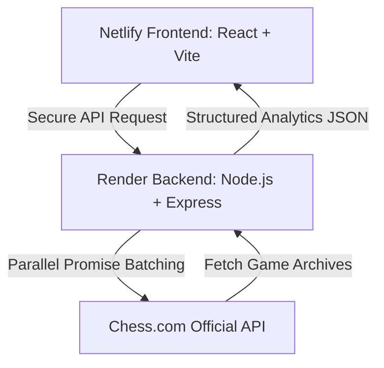

# ♟️ Chess.com Global Analysis Dashboard (by saheb423003 / saheb142003)

> 🚀 **Live Production App:** [analyzechess.netlify.app](https://analyzechess.netlify.app)  
> 🔗 **Alternative Mirror:** [saheb142003.netlify.app](https://saheb142003.netlify.app)

---

## 🌍 Unleash Regional Dominance with Professional Chess Analytics

Welcome to the ultimate, high-performance scouting engine for Chess.com players. Created by **Md Sahebuddin Ansari** (internationally known on the web as **saheb423003** and **saheb142003**), this dashboard is engineered to dissect your complete chess history across borders, openings, time controls, and specific rivals.

Whether you want to scout which country's players struggle against your tactical style, isolate your performance in **Blitz**, **Bullet**, or **Rapid**, or track your rating swings against specific openings—this dashboard processes hundreds of matches in parallel to deliver real-time strategic intelligence.

---

## 🏆 Prime Features

### 🗺️ 1. Global Scouting & Country Mapping
*   **Real-time Parsing**: Instantly converts Chess.com country URLs into clean country names and high-quality flag indicators.
*   **Territorial Scorecards**: Track exact Win/Loss/Draw ratios against opponents of any specific nationality.

### 📈 2. Tactical Opening Analytics
*   **Base Opening Isolation**: Group games dynamically by the main opening played (e.g., *Sicilian Defense*, *Ruy Lopez*, *Queen's Gambit*).
*   **Opening Win-Rates**: Instantly spot which lines yield your highest success rate.

### ⚡ 3. Multi-Dimensional Dynamic Filters
*   **Time-Range Isolation**: Filter matches played in the *Last Week*, *Last Month*, or *Last 3 Months*.
*   **Game-Type Selectors**: Isolate and analyze *Rapid*, *Blitz*, or *Bullet* play formats instantly.
*   **Combined Search**: Query specific opponents across distinct game speeds and nations with millisecond latency.

### 🎨 4. Premium Dark UI/UX
*   **Pure Chess.com DNA**: Immersed in chess-themed dark mode palettes, premium glassmorphism surfaces, and classic high-fidelity green win/loss badges.
*   **Sticky Dynamic Workspace**: A modern sticky-layout sidebar with independent scrolling for high-fidelity desktop presentation.

---

## 🛠️ High-Performance Architecture

### **The Technology Engine**
*   **Frontend**: React, Vite, and Vanilla CSS with custom theme variables for maximum performance.
*   **Backend**: Node.js & Express API with a parallel fetching algorithm to retrieve multiple monthly archives simultaneously.
*   **SEO System**: Integrated JSON-LD structured schema mapping developer profiles (**saheb423003**, **saheb142003**, **Md Sahebuddin Ansari**) directly to search engines.

---

## 🚀 Unified Netlify + Render Deployment Blueprint

Follow this bulletproof guide to deploy the entire application in under 5 minutes with zero configuration errors.

### 🟢 Part A: Deploy the Backend on Render
1.  Sign in to [Render.com](https://render.com) and click **New > Web Service**.
2.  Connect your GitHub repository: `saheb142003/chess.com-countryfilters`.
3.  Configure the following settings:
    *   **Name**: `chess-com-countryfilters`
    *   **Root Directory**: `backend`
    *   **Runtime**: `Node`
    *   **Build Command**: `npm install`
    *   **Start Command**: `npm start`
4.  Click **Deploy Web Service**. Once live, Render will provide your primary backend URL:
    *   *Example:* `https://chess-com-countryfilters.onrender.com`

---

### 🔵 Part B: Deploy the Frontend on Netlify
1.  Sign in to [Netlify.com](https://netlify.com) and click **Add new site > Import an existing project**.
2.  Link your GitHub repository.
3.  Netlify will automatically detect the root **`netlify.toml`** file, which configures:
    *   **Publish Directory**: `frontend/dist`
    *   **Build Command**: `cd frontend && npm install && npm run build`
4.  **Crucial Step (Environment Variables)**:
    *   Go to **Site Configuration > Environment Variables** on Netlify.
    *   Add a new environment variable:
        *   **Key**: `VITE_API_URL`
        *   **Value**: `https://your-render-app-url.onrender.com` (Use the URL from Part A).
5.  Click **Deploy Site**. Your beautiful front-end is live and linked!

---

## 🔍 Infinite SEO Metadata & Search Keywords

To guarantee first-page ranking for the developer and this application, this repository is optimized for the following search criteria:

*   **Primary Names**: `saheb423003`, `saheb142003`, `Md Sahebuddin Ansari`, `Sahebuddin Ansari`.
*   **Core Keywords**: `analyze chess`, `chess country filter`, `chess global performance dashboard`, `chess.com regional stats`, `saheb chess filter`, `chess.com country analyzer`, `saheb142003 netlify`.
*   **Tech Stack Keywords**: `vite react chess dashboard`, `node express chess api`, `render chess backend`, `netlify chess app`.

---

## 💎 Lead Architect & Developer

### **Md Sahebuddin Ansari**
Designed, developed, and deployed with absolute passion. Connect with me and explore my other premium creations:

> *"In chess, as in code, every single move must have a definitive purpose. This dashboard is the ultimate reflection of that philosophy."*

---

© 2026 Chess.com Global Analysis Dashboard | Developed by [saheb423003](https://github.com/saheb142003)
